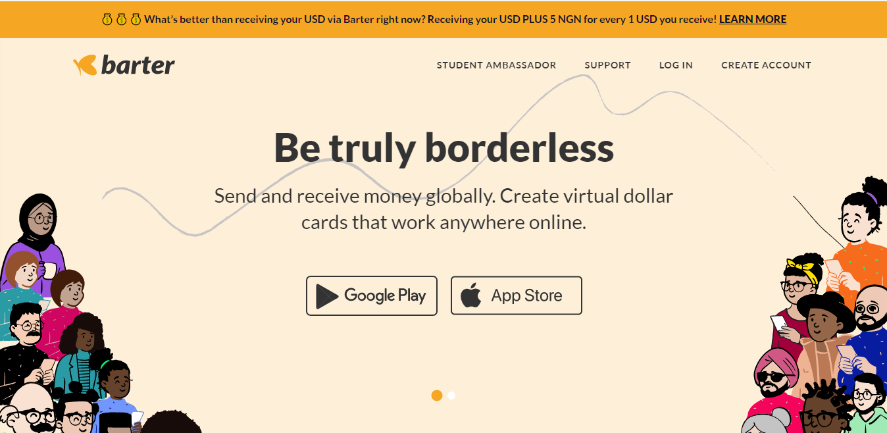
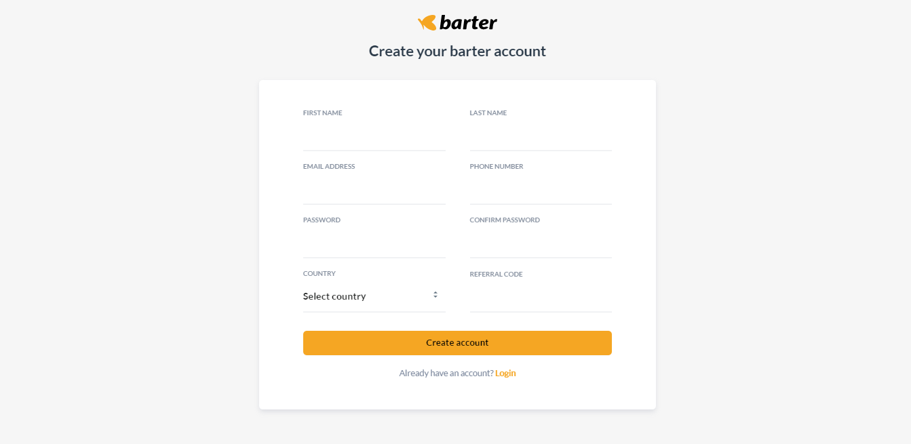
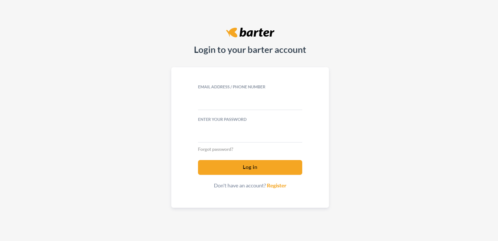

# Barter-Clone

Barter by Flutterwave is a lifestyle payment solution used by over 500,000 people to send money to and from Africa for free, receive money from abroad, create virtual cards for online shopping, pay bills and make instant payments online. 

We found the web app exciting and decided to make a clone of it. We created four(4) pages in all: 
* The Landing Page 
* The Register page 
* The Login Page and 
* The Student Ambassador Page.

You can read about our experience [here](https://kamet.hashnode.dev/portfolio-team-2-project-experience-frontend-html-css-and-javascript)

## :page_facing_up: Table of contents

* [:zap: Barter Clone](#zap-barter-clone)
	* [:camera: Screenshots](#camera-screenshots)
	* [:signal_strength: Technologies](#signal_strength-technologies)
    * [:cool: Live-Solution](#cool-live-solution)
	* [:envelope: Contact](#envelope-contact)
    * [:pen: Contributors](#pen-contributors)

## :camera: Screenshots

## :signal_strength: Technologies

* [HTML](https://html.com/) for markup.
* [CSS](https://developer.mozilla.org/en-US/docs/Web/CSS) for styling.
* [Javascript](https://www.javascript.com/) for adding functionalities and making it interactive.
* [Netlify](https://www.netlify.com/) for hosting the project.

## :cool: Live-Solution

* Here is the [Link](https://barter.me/) to the original site.
* Here is the [Link](https://barter-clone-233.netlify.app/) to the live solution of the clone.

## :envelope: Contact

* Repo created by [Moyinoluwa](https://github.com/moyinoluwa-10/), email: moyinadelowo@gmail.com

## :pen: Contributors

* [Moyinoluwa](https://github.com/moyinoluwa-10/)
* [Tobechukwu](https://github.com/TOBAE/)
* [Ebuka](https://github.com/tzfocus7/)
* [Mardiyyah](https://github.com/Mardie328/)
* [Ayotoke](https://github.com/tokebillions/)
* [Victor](https://github.com/chuka00/)
* [Julius](https://github.com/MacJulius48/)
* [Tobi](https://github.com/Toby48-K/)
